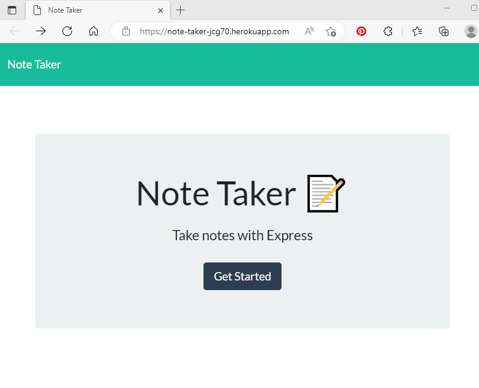
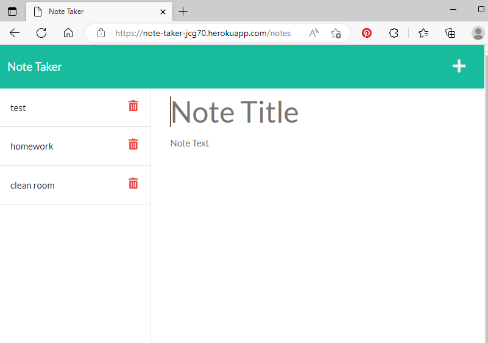

  # Note-Taker
  

  [](https://opensource.org/licenses/MIT)
  
 
  ## Description
  This app uses Express.js and is deployed on Heroku, and allows the user to enter a Note Title, a text entry to add information about that note. The Note will be saved and stored server side to be available in app for next use. These notes can be deleted by clicking on the garbage can icon in the save notes section.
  
  ## User Story

  ```
  AS A small business owner
  I WANT to be able to write and save notes
  SO THAT I can organize my thoughts and keep track of tasks I need to complete
  ```

  ## Acceptance Criteria

  ```
  GIVEN a note-taking application
  WHEN I open the Note Taker
  THEN I am presented with a landing page with a link to a notes page
  WHEN I click on the link to the notes page
  THEN I am presented with a page with existing notes listed in the left-hand column, plus empty fields to enter a new note title and the note’s text in the right-hand column
  WHEN I enter a new note title and the note’s text
  THEN a Save icon appears in the navigation at the top of the page
  WHEN I click on the Save icon
  THEN the new note I have entered is saved and appears in the left-hand column with the other existing notes
  WHEN I click on an existing note in the list in the left-hand column
  THEN that note appears in the right-hand column
  WHEN I click on the Write icon in the navigation at the top of the page
  THEN I am presented with empty fields to enter a new note title and the note’s text in the right-hand column
  ```
 
  ## Table of Contents
  - [Usage](#usage)
  - [Contributing](#contributing)
  - [Screenshots](#screenshots)
  - [Links](#links)
  - [Questions](#questions)
  

  ## Usage
  
 
  Usage Information: 
 
  While using the application, the user can add and remove notes. Each note has a title, with a text field to be filled in about that note.
 
  ## Contributing
  

  If you would like to contribute to this repository, follow these instructions: 
  

  This repository is open to the public to access, please feel free to comment.
  
  ## Screenshots

  
  
  

  ## Links
  Application
  https://note-taker-jcg70.herokuapp.com/notes

  Repository
  https://github.com/jcgilbert70/Note-Taker.git
  
  
 
  ## Questions
  Any questions about this project please contact the creator jcgilbert70 at:
  jcgilbert70@gmail.com
  

  Check out other repositories by this creator at: https://github.com/jcgilbert70
  

  ## License: MIT
  
 
  MIT License Link: https://opensource.org/licenses/MIT

  
